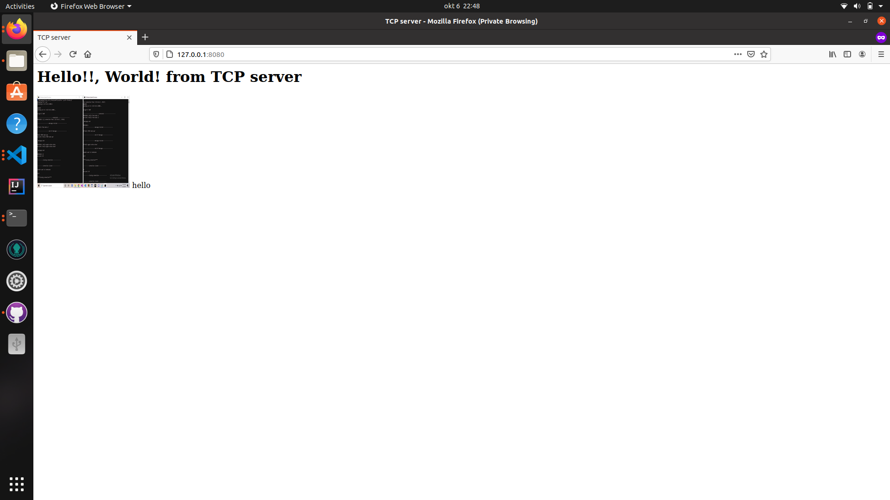
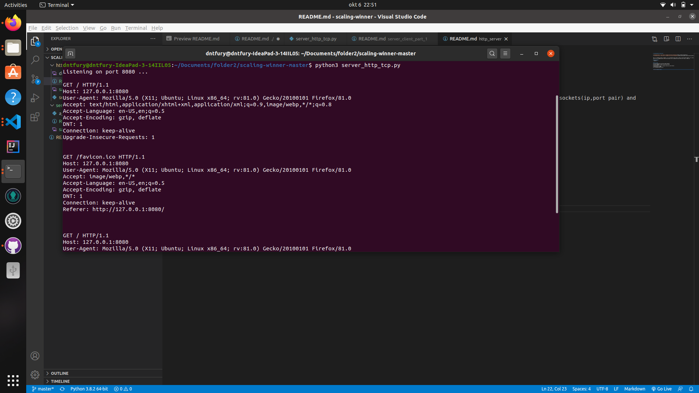

# scaling-winner http_server

This is a program written in python, it is a TCP based server which is able to return HTTP responce. It is done with the sockets(ip,port pair) and can be run in command promt [CMD].This have been run in windows and Linix have not tried in other OS.

## Requirements 
> python 3+ 

## How to Run 
1) In the directory of the file open Terminal 
2) Write command as python server_http_tcp.py 
3) It will start
4) Open Browser (Tested in Google Chrome only and Firefox)
5) Type 127.0.0.1:8000
6) To terminate press Ctrl+C

